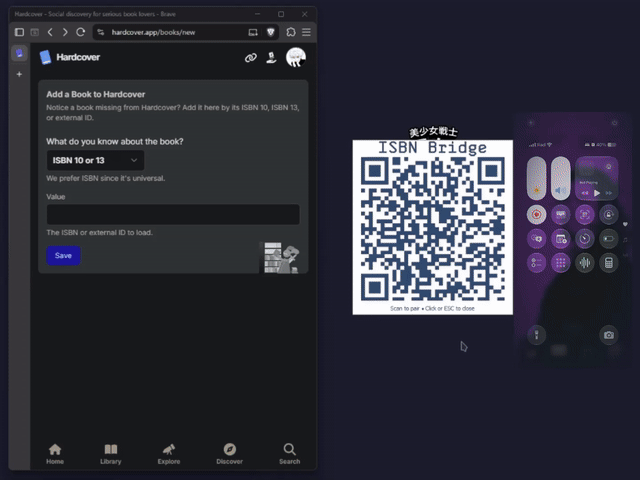

# ISBN Bridge


[](https://github.com/denialbb/ISBN-bridge/blob/main/docs/assets/bridge_demo.mp4)

**ISBN Bridge** connects mobile barcode scanning directly to your PC. Scan book barcodes with your phone; each ISBN is cryptographically authenticated, checksum-verified, and typed or pasted into the active field on your PC (Windows or Linux).

---

## How It Works

```
[Phone Camera Scanner (iPhone / Android)]
        │  (USB Cable Tethering or Wi-Fi LAN)
        │  HTTP POST /isbn
        │  Authorization: Bearer SHA256(ISBN|Timestamp|Token)
        ▼
[Go Backend Server (:8765)]
   - Auto-detects USB cable vs Wi-Fi LAN
   - Authenticates SHA-256 signature
   - Validates ISBN-10 / ISBN-13 checksum
        │  (Localhost)
        │  HTTP POST /paste
        ▼
[Desktop Client (:8766) - Windows AHK / Linux Python]
   - Hover paste into active textbox
   - Centered QR pairing popup
   - Audio tap feedback & tray controls
```

---

## Features

- **Direct USB Cable & Wi-Fi LAN**: Connect your iPhone or Android phone directly over USB cable (USB tethering) for instantaneous, low-latency scanning that operates completely offline and air-gapped from Wi-Fi LAN, or scan over local Wi-Fi. Hot-plugging USB dynamically detects interface shifts and updates pairing endpoints.
- **Cross-Platform Native Clients**:
  - **Windows (AutoHotkey v2)**: Native taskbar tray, non-blocking Winsock listener, sound effects, and focus-targeted auto-typing.
  - **Linux (Python 3.10+)**: Full Wayland (Hyprland, Sway, GNOME) and X11 support, desktop notifications, native system tray with auto theme tinting (Omarchy / freedesktop symbolic), left-click quick action to show pairing QR, and automated typing via `wtype`, `xdotool`, or `uinput`.
- **Instant Desktop Pairing**: Centered borderless QR modal pops up on your active monitor at startup or whenever the security token rotates. Left-clicking the Linux tray icon or tray menu instantly triggers the QR code.
- **Hover Paste**: If your mouse or focus is over a text field in your target window (e.g. Hardcover), the ISBN pastes without manual clicking.
- **Zero Information Leakage**: Strict logging hygiene ensures rotating security tokens, pairing URL secrets, and unvalidated payloads are never written to standard output or debug log files.
- **Unified Configuration**: All ports, network modes, timings, and behaviors are configured through a single file: [`scanner.conf`](scanner.conf).
- **Taskbar Tray Controls**: Left-click for QR code, right-click to change token expiration (15m to 24h), toggle hover paste, audio, or overwrite mode on the fly.
- **Audio Feedback**: Short tap sound feedback when an ISBN is successfully pasted.
- **Multilingual**: English and Italian ship by default (auto-detected from OS, switchable in tray). More languages are drop-in files — see [Configuration](docs/CONFIGURATION.md).

---

## Security Implementation

The system is designed to prevent unauthorized devices on your local Wi-Fi or tethered network from injecting text or keystrokes into your desktop:

1. **Air-Gapped Direct USB Connection**: When tethered via USB cable, traffic flows strictly over a point-to-point IP link (`172.20.10.x` for iOS or `192.168.4x.x` for Android), isolating scan traffic from any local Wi-Fi eavesdroppers.
2. **Rotating Secret Tokens**: The Go server generates a 48-character cryptographic token (`crypto/rand`). Tokens automatically rotate based on your configured TTL (default: 60 minutes).
3. **SHA-256 Signatures**: The mobile phone never transmits the secret token across the network. Instead, it signs every scan:
   $$\text{Signature} = \text{SHA-256}(\text{ISBN} \parallel \text{Timestamp} \parallel \text{Token})$$
4. **Replay & Timing Attack Protection**:
   - Requests with a missing/unparseable timestamp, or outside the tight ±15s window, are rejected.
   - Each accepted signature is single-use (in-memory replay cache, 100 entries / 60s TTL).
   - `POST /isbn` is rate-limited per IP (2 requests / 10s; `429` beyond that).
   - Hash verification uses constant-time comparison (`crypto/subtle.ConstantTimeCompare`).
5. **Zero Information Leakage in Logs**: Console output and debug logs completely redact token material and pairing URLs, and strip query strings and unvalidated payloads.
6. **Localhost Control Boundary**: Control endpoints (`/token/refresh`, `/token/ttl`, `/console/*`, `/shutdown`) only accept loopback requests (`127.0.0.1`, `::1`), and forwarding to the desktop client is protected by a separate startup secret (`local_secret.txt` with `0600` permissions).

For full details, see [docs/SECURITY.md](docs/SECURITY.md).

---

## Mobile Scanning

### iOS (Apple Shortcuts)

Scanning on iPhone uses two Apple Shortcuts:

1. **Token Pairing Shortcut**: Scans the centered QR code on your PC monitor and stores the token locally.
2. **Continuous Scanner Shortcut**: Opens the camera in a fast barcode-scanning loop, signs each ISBN with SHA-256, and posts it to your PC.

- ISBN Bridge: https://www.icloud.com/shortcuts/46434ad59d2b4bff92f8a2460bee9207
- Pair ISBN Bridge: https://www.icloud.com/shortcuts/2cc219d6251f46d69ce5d6d3f4ce8cc8

### Android (HTTP Shortcuts)

Android is supported via [HTTP Shortcuts](https://f-droid.org/packages/ch.rmy.android.http_shortcuts/) (free, open-source) with [Binary Eye](https://f-droid.org/packages/de.markusfisch.android.binaryeye/) as the barcode scanner backend. Same protocol, no server changes.

For full setup instructions, see [docs/SHORTCUTS.md](docs/SHORTCUTS.md).

---

## Requirements

- **PC Operating System**:
  - **Windows**: Windows 10/11 64-bit.
  - **Linux**: Any modern distribution with Python 3.10+, PyGObject (`gir1.2-ayatanaappindicator3-0.1` or `libayatana-appindicator3-1`), and typing tools: `wtype` (Wayland) or `xdotool` (X11).
- **Phone**:
  - **iOS**: iPhone with Shortcuts app (preinstalled).
  - **Android**: [HTTP Shortcuts](https://f-droid.org/packages/ch.rmy.android.http_shortcuts/) + [Binary Eye](https://f-droid.org/packages/de.markusfisch.android.binaryeye/) (both free, open-source).
- **Connection**:
  - **Direct USB Cable (Recommended)**: Plug phone into PC with USB cable and enable Personal Hotspot / USB Tethering.
  - **Wi-Fi LAN**: Phone and PC connected to the same local network subnet.

---

## Quick Start

### Windows

1. Download `ISBN-Bridge-v1.0.3-windows-x64.zip` from the [Releases page](https://github.com/denialbb/ISBN-bridge/releases) and extract anywhere.
2. Double-click **`ISBN-Bridge.exe`** — it starts the background server and displays the centered pairing QR code.
3. *(Building from source)*:
   ```powershell
   go build -o bin/isbn-bridge-server.exe ./cmd/server
   & "C:\Program Files\AutoHotkey\v2\AutoHotkey64.exe" "client\main.ahk"
   ```

### Linux

1. Build the server binary or let the client compile/run it:
   ```bash
   go build -o bin/isbn-bridge-server ./cmd/server
   ```
2. Run the Linux client with `uv` or `pip`:
   ```bash
   cd client_linux
   uv run client-linux
   # Or install into your Python environment:
   pip install -e .
   isbn-bridge-linux
   ```
3. The indicator appears in your system tray (supporting Hyprland, Omarchy, Sway, GNOME, KDE). Left-click the tray icon at any time to open the centered pairing QR modal.

### Pair & Scan


When the Go server starts, a QR code appears in the center of your screen.
Scan it with your phone, then run your Scanner Shortcut on any book barcode.
Full steps: [Mobile Client Setup](docs/SHORTCUTS.md).

---

## Detailed Documentation

- [Architecture & Technical Specifications](docs/ARCHITECTURE.md)
- [Security Architecture & Threat Model](docs/SECURITY.md)
- [Configuration Reference (`scanner.conf`)](docs/CONFIGURATION.md)
- [Mobile Client Setup (iOS & Android)](docs/SHORTCUTS.md)

---

## Credits

- Tray icon: [Barcode Scan icon by UXWing](https://uxwing.com/barcode-scan-icon/) (free for commercial use, whitened for tray legibility).
- Popup brand artwork rendered with [Skyhook Mono by FontomType](https://www.fontsquirrel.com/fonts/skyhook-mono) (desktop license; font file not distributed).
