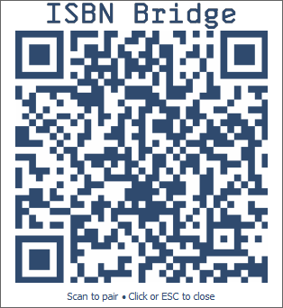

# ISBN Bridge


**ISBN Bridge** connects mobile barcode scanning to your PC. Scan book barcodes with your phone and have them verified, authenticated, and pasted directly into your desktop browser or cataloging tools in real-time.

---

## How It Works

```
[Phone Camera Scanner]
        │  (Wi-Fi LAN)
        │  HTTP POST /isbn
        │  Authorization: Bearer SHA256(ISBN|Timestamp|Token)
        ▼
[Go Backend Server (:8765)]
   - Authenticates SHA-256 signature
   - Validates ISBN-10 / ISBN-13 checksum
        │  (Localhost)
        │  HTTP POST /paste
        ▼
[AutoHotkey Desktop Client (:8766)]
   - Zero-click hover paste into active textbox
   - Centered seamless QR pairing popup
   - Audio tap feedback & tray controls
```

---

## Features

- **Seamless Desktop Pairing**: A clean, centered QR code pops up on your monitor whenever the security token rotates. Scan once with your phone to pair.
- **Zero-Click Hover Paste**: If your mouse is hovering over a text field in your target window (e.g. Hardcover), the ISBN pastes automatically without requiring a click.
- **Unified Configuration**: All ports, timings, and behaviors are customized through a single file: [`scanner.conf`](scanner.conf).
- **Taskbar Tray Controls**: Right-click the tray icon to change token expiration (15m to 24h), toggle hover paste, audio, or overwrite mode on the fly.
- **Tactile Audio Feedback**: Plays a crisp tap sound when an ISBN is pasted.

---

## Security Implementation

The system is designed to prevent unauthorized devices on your local Wi-Fi from injecting text or keystrokes into your desktop:

1. **Rotating Secret Tokens**: The Go server generates a 48-character cryptographic token (`crypto/rand`). Tokens automatically rotate based on your configured TTL (default: 60 minutes).
2. **SHA-256 Signatures**: The mobile phone never transmits the secret token across the network. Instead, it signs every scan:
   $$\text{Signature} = \text{SHA-256}(\text{ISBN} \parallel \text{Timestamp} \parallel \text{Token})$$
3. **Replay & Timing Attack Protection**:
   - Requests with a missing/unparseable timestamp, or outside the tight ±15s window, are rejected.
   - Each accepted signature is single-use (in-memory replay cache, 100 entries / 60s TTL).
   - `POST /isbn` is rate-limited per IP (2 requests / 10s; `429` beyond that).
   - Hash verification uses constant-time comparison (`crypto/subtle.ConstantTimeCompare`).

For deep technical details, see [docs/SECURITY.md](docs/SECURITY.md).

---

## Mobile Scanning

### iOS (Apple Shortcuts)

Scanning on iPhone is handled natively via two lightweight Apple Shortcuts:

1. **Token Pairing Shortcut**: Scans the centered QR code on your PC monitor and stores the token locally.
2. **Continuous Scanner Shortcut**: Opens the camera in a fast barcode-scanning loop, signs each ISBN with SHA-256, and posts it to your PC.

- ISBN Bridge: https://www.icloud.com/shortcuts/46434ad59d2b4bff92f8a2460bee9207
- Pair ISBN Bridge: https://www.icloud.com/shortcuts/2cc219d6251f46d69ce5d6d3f4ce8cc8

### Android (Planned)

Support for Android devices is planned using the same cryptographic protocol. Future updates will provide scripts/configs compatible with open-source automation apps (such as _HTTP Shortcuts_ or _Tasker_) and a dedicated lightweight web scanner.

For full setup instructions, see [docs/SHORTCUTS.md](docs/SHORTCUTS.md).

---

## Quick Start

### Recommended: download the release

1. Get `ISBN-Bridge-v1.0.0-windows-x64.zip` from the
   [Releases page](https://github.com/denialbb/ISBN-bridge/releases) and
   extract it anywhere (e.g. `Documents\ISBN-Bridge`).
2. Double-click **`ISBN-Bridge.exe`** — it starts the server automatically
   and shows the pairing QR code in the center of your screen.
3. (Optional) Press `Win+R`, type `shell:startup`, and drop a shortcut to
   `ISBN-Bridge.exe` there to start it with Windows.

### From source

```powershell
# Build the server
go build -o bin/isbn-bridge-server.exe ./cmd/server

# Run the desktop client (requires AutoHotkey v2)
& "C:\Program Files\AutoHotkey\v2\AutoHotkey64.exe" "client\main.ahk"
```

### Pair & Scan



1. When the Go server starts, a QR code appears in the center of your screen.
2. Point your phone's normal **Camera app** at the QR code and tap the link to pair automatically (no typing required!).
3. Launch your **Scanner Shortcut** and point your camera at any book barcode!

---

## Detailed Documentation

- [Architecture & Technical Specifications](docs/ARCHITECTURE.md)
- [Security Architecture & Threat Model](docs/SECURITY.md)
- [Configuration Reference (`scanner.conf`)](docs/CONFIGURATION.md)
- [Mobile Client Setup (iOS & Android)](docs/SHORTCUTS.md)

---

## Credits

- Tray icon: [Barcode Scan icon by UXWing](https://uxwing.com/barcode-scan-icon/) (free for commercial use, whitened for tray legibility).
- Popup brand artwork rendered with [Skyhook Mono by FontomType](https://www.fontsquirrel.com/fonts/skyhook-mono) (desktop license; font file not distributed).
